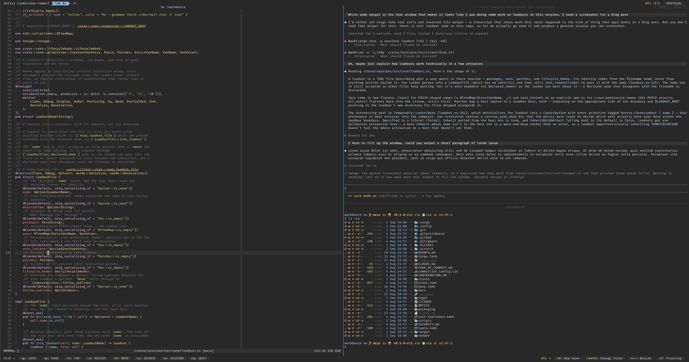

<h1 align="center">Cozy Loadout</h1>

<p align="center"><strong>One Palette, Every Tool</strong><br>A themed terminal loadout for Minimal — fish, helix, zellij, starship, bat, delta and more, generated from a single base16 scheme.</p>

<p align="center">
  <a href="#quick-start">Quick Start</a> ·
  <a href="#the-wizard">The Wizard</a> ·
  <a href="#choosing-a-scheme">Schemes</a> ·
  <a href="#whats-in-it">What's In It</a> ·
  <a href="AGENTS.md">Working on it</a> ·
  <a href="https://minimal.dev/docs">Minimal Docs</a>
</p>

<p align="center">
  <a href="https://github.com/gominimal/cozyloadout/actions/workflows/ci.yml"></a>
  <a href="LICENSE"></a>
  <a href="https://minimal.dev/docs"></a>
  <a href="https://discord.com/invite/qgX8sm6X7G"></a>
  <a href="https://www.rust-lang.org/"></a>
</p>

---

## What is it?

A [Minimal](https://github.com/gominimal/minimal) loadout that themes your whole terminal from one base16 scheme.

Instead of hand-maintained dotfiles, this repo ships **templates and a renderer**. You give it a scheme; it generates every config file in the set from that one palette, bundles them, and installs them where Minimal expects them. Re-theming the terminal is one command.

Twelve tools get a themed config file, and a dozen more are configured through the environment. They all land on the same sixteen colours, so a diff in `delta`, a file in `bat`, and that same file open in `helix` agree.

**Minimal Dark** and **Minimal Light** are included, matching the Minimal System design tokens. Any [tinted-theming](https://github.com/tinted-theming/schemes) scheme works too — `just fetch-schemes` pulls the upstream base16 and base24 collection, all of which is rendered in CI.

<p align="center">
  
  <br>
  <em>helix, an agent, and fish under zellij — one scheme across all of it. Shown in <code>decaf</code>, one of the upstream schemes.</em>
</p>

## Quick Start

```shell
git clone git@github.com:gominimal/cozyloadout.git
cd cozyloadout

just wizard
```

That walks you through picking a scheme, choosing packages, and installing —
see [The wizard](#the-wizard). Then apply the loadout and attach:

```shell
min session activate --loadout cozy --attach .
```

`min attach` drops you into fish, which starts zellij. Everything else — git pointed at delta's config, bat's theme cache, fish completions — is done by the loadout's `on_activate` hook. There is no manual setup step.

## Requirements

| Tool | Used for |
| --- | --- |
| [`just`](https://github.com/casey/just) | running the recipes |
| Rust — `cargo` and `rustc`, 1.88+ | building the renderer and the wizard |
| `bash` | recipe bodies |
| `zip` | `just bundle`, which produces the distributable `cozy.zip` |
| `git` | cloning this repo; also `just fetch-schemes` |
| Minimal **0.5.4+** | installing the loadout — earlier versions don't support `$LOADOUT_ROOT` patch sources or the `SHELL` handover |

Plus the usual POSIX userland. `fish` and `dash` are optional, used only by `just check` to syntax-check generated files.

You do **not** need the tools being themed — helix, zellij, bat and the rest. Minimal installs those when the loadout is applied.

## The wizard

`just wizard` is the recommended way to set the loadout up. Seven screens:

| | |
| --- | --- |
| **Greeting** | five greetings previewed in your own font: three versions of the Minimal mark drawn from different Unicode blocks, the detach line on its own, or nothing at all — and whether to draw Nerd Font icons in the file lists, shown rather than described |
| **Schemes** | offers to download or update the upstream scheme collection |
| **Themes** | every scheme on disk, with the whole interface re-painting in each one as you scroll, next to a preview of a prompt, highlighted code and a diff — `a` opens six adjustments |
| **Packages** | which optional packages to install, with a description and licence for each, plus a field for any others you want |
| **Patches** | file and directory pickers for your own dotfiles, with a preview of whatever is under the cursor — a file's contents, syntax-highlighted in the scheme you picked, or what copying a folder in would actually bring |
| **Detach** | the leader and detach chords, checked against the rules minimal enforces |
| **Resources** | how many cores and how much memory the microVM gets, within minvmd's own limits |

It ends with a summary, a tick for whether to install (on by default, `space`
toggles), and four choices: generate, save these settings to a file, save and
exit, or abort. `esc` goes back a screen from anywhere, and your answers are
remembered in a gitignored `.cozy-wizard.toml` so the next run starts where you
left off, at `~/.config/cozy/settings.toml`.

Nothing you create lands in the checkout: saved schemes and remembered answers
both live under `~/.config/cozy/`, so they survive re-cloning the repo.

### Settings files

That file is portable. Save one under a name of your own — from the last screen,
or with `just wizard --settings mine.toml` — and it describes the whole loadout:
scheme, adjustments, greeting, packages, patches. Rebuild from it anywhere,
without the interface:

```shell
cozy-theme --settings mine.toml              # render exactly what it records
cozy-theme --settings mine.toml --greeting none   # …with one answer changed
```

It's worth committing to a dotfiles repo.

The last two screens configure **minimal itself, not the loadout** — they write
`~/.config/minimal/config.toml` and run `minvmd config set`, and they apply to
every session rather than only this one. They only act when you change something
away from the default, and only under *generate and install*; *generate* leaves
everything outside this repo alone. The summary marks both rows so it's clear
before anything is written.

### Without the wizard

The loadout itself is entirely reachable from the recipes:

```shell
just fetch-schemes             # optional: pull in the upstream schemes
just theme gruvbox-dark-hard   # render into build/, bundle into cozy.zip
just install                   # copy build/ into ~/.config/minimal/loadouts/
```

Skip `just fetch-schemes` and `just theme` builds `minimal-dark`, which is checked in. The renderer takes the same choices the wizard collects — `--greeting`, `--with`, `--patch-file`, `--patch-dir` — so nothing is only reachable through the interface:

```shell
cargo run --release --manifest-path tools/cozy-theme/Cargo.toml -- --help
```

The two host-level screens have no recipe, because neither is the loadout's to
set. Do those yourself: put `[session-keys]` in `~/.config/minimal/config.toml`
(see minimal's loadouts reference for the rules), and run
`minvmd config set --vcpus N --ram-mib M`.

## Patching in your own files

The wizard's patches page — or `--patch-file` and `--patch-dir` — copies your own dotfiles into the session alongside the loadout's. Destinations are relative to the session's home, so a path under your home keeps its shape and one outside it drops the leading `/`:

| You pick | Lands at |
| --- | --- |
| `~/.config/starship.toml` | `~/.config/starship.toml` |
| `~/.gitconfig` | `~/.gitconfig` |
| `/etc/hosts` | `~/etc/hosts` |
| `~/.config/helix` | `~/.config/helix/`, whole tree |

If one of your files collides with a config the loadout ships, **yours wins** and the loadout's is left out rather than both being written. The wizard says which ones, on the patches page and again on the summary before anything is generated.

## Adjusting a scheme

`a` on the wizard's theme screen — or the matching flags — tunes the scheme you picked. Each is a percentage from -100 to 100, and all-zero renders exactly what the scheme publishes:

| | |
| --- | --- |
| `--contrast` | push the surface and foreground apart |
| `--saturation` | how vivid the eight accents are |
| `--comments` | lift `base03` toward the foreground, or sink it |
| `--separation` | spread `base01`/`base02` so a selection reads |
| `--background` | deepen the background, or lift it off black |
| `--warmth` | a warm or cool cast |

The wizard shows the WCAG contrast ratio for body text as you turn them, with a pass mark at 4.5:1. There's no hue control on purpose: `base08` is red because errors are red, and rotating it would make them green.

An adjusted scheme is written under its own name — `gruvbox-dark-medium-224a` — so it never overwrites the theme files of the scheme it came from.

Adjustments belong to the scheme you made them against: moving to a different scheme in the list clears them, and they're remembered between runs along with the scheme itself.

To keep one, press `s` (or pass `--save-as "My Theme"`). It writes `~/.config/cozy/schemes/my-theme.yaml` with the adjustments baked in — a scheme of its own, so `just theme my-theme` picks it up from any checkout and the knobs go back to zero.

## Choosing a scheme

```shell
just theme                      # the default, minimal-dark
just theme minimal-light
just theme rose-pine-dawn       # anything under schemes/
just theme ~/my-scheme.yaml     # any path
```

Bare names resolve from `schemes/`, then `schemes/vendor/base16/`, then `schemes/vendor/base24/`, so a scheme checked in here wins over a vendored one of the same name. Both scheme formats are accepted — the current `palette:` block and the pre-2022 top-level layout. The upstream `tinted8` schemes are an 8-colour system this can't use and are never resolved to.

A base16 scheme *is* dark or light, so there's no light/dark switch in the loadout — changing palette means running `just theme` again. Use `just render <scheme>` to look at `build/` before committing to one.

## Installing

`just install` replaces `~/.config/minimal/loadouts/cozy/`. Applying the loadout is Minimal's job; the patches then land in the session's `~/.config`.

Theme files are named after the scheme rather than a fixed name, so switching schemes doesn't overwrite the previous one's. The loadout directory is wiped and rebuilt on every `just install`, so nothing accumulates there. A **session that was already running** under the old scheme keeps the old theme files in its `~/.config`, though: patches are filesystem mappings established when the sandbox is built, so they only add. They're inert — extra entries in `hx --health` and `bat --list-themes` — and a session created after the switch has only the current scheme's.

The loadout writes outside `~/.config` in exactly two places: it appends `include.path` entries to your git config (checking first, so your own includes are never touched), and it writes fish completions to `$XDG_DATA_HOME/fish/vendor_completions.d`, which is lower precedence than your own.

## What's In It

Always installed — the shell and the tools the config builds itself around:

| | |
| --- | --- |
| **Shell and session** | fish, starship, zellij |
| **Editing and reading** | helix, bat |
| **Search and navigation** | ripgrep, fd, eza, zoxide, sd |
| **Git and system** | git, delta, difftastic, gh, procs, bottom |

Optional, offered by the wizard and dropped with their configs if you decline
them: atuin, lazygit, broot, tealdeer, fzf, jq, claude-code, dust,
duf, hexyl, tokei, hyperfine, bandwhich, glow and kittyview. The split lives in
`templates/packages.toml`, along with the GNU userland every session gets.

## Building and Testing

| Recipe | Does |
| --- | --- |
| `just wizard` | **Interactive setup — the recommended way in** |
| `just` | List recipes and available schemes |
| `just theme [scheme]` | Render + bundle. Defaults to `minimal-dark` |
| `just render [scheme]` | Render only, no zip |
| `just install` | Copy `build/` into `~/.config/minimal/loadouts/` |
| `just schemes` | List what `just theme` will accept |
| `just vendored` | List the vendored upstream schemes |
| `just fetch-schemes` | Clone the upstream scheme collection |
| `just check` | The full local gate — everything CI runs |
| `just check-schemes` | Render every vendored scheme |
| `just clean` | Drop build artifacts |

`just --list` shows the rest, including the individual `test`, `fmt`, `lint` and `deny` recipes that `just check` bundles.

**Edit `templates/`, never `build/`** — `build/` is deleted and rewritten on every render. Run `just check` before opening a PR, and `just check-schemes` too if you touched a template or the renderer.

[AGENTS.md](AGENTS.md) is the guide to the internals: the render pipeline, the template grammar, per-tool notes, and a record of what's been verified versus assumed.

## Known gaps

1. **broot's file preview is off-scheme.** broot renders previews with syntect and only accepts one of six themes built into its binary. The skin picks the nearest by luma, so the preview pane is the one surface not on your scheme.

2. **A long-lived session keeps old theme files** after you switch schemes. The loadout directory is rebuilt on each install, but Minimal's patches only add files to a session, never remove them — so the previous scheme's themes linger in an already-running session's `~/.config`. A new session is clean. See [Installing](#installing).

3. **Schemes aren't checked for legibility.** The renderer validates structure, not contrast. A scheme whose comments sit at 3:1 against its own background renders exactly as given.

4. **The terminal surface isn't verified through zellij.** fish sets the terminal's background, foreground, cursor and 16-colour table over OSC escapes. The first apply happens before zellij starts; the per-attach re-apply goes through a zellij pane, and whether zellij forwards those to the host terminal hasn't been confirmed. Terminals that ignore a sequence do so silently.

5. **Re-attaching takes one keypress to come back on-scheme.** A screen replay carries no terminal colours, so the palette is re-sent on the next prompt. The first moment after re-attaching can show the previous terminal's colours; pressing return fixes it.

## Contributing

Bug reports, better colours, docs fixes, and new tools are all welcome. [Open an issue](https://github.com/gominimal/cozyloadout/issues/new/choose) to outline what you're after, and see [CONTRIBUTING.md](./CONTRIBUTING.md) for the workflow.

Before we can merge your first pull request you'll need to accept our **Individual Contributor License Agreement**. [CLA Assistant](https://cla-assistant.io/) posts a link on your PR; it takes about 30 seconds and covers all your future contributions. If you're contributing on your employer's time, they'll also need a **Corporate CLA** on file. Full text: [ICLA](./legal/ICLA.md) · [CCLA](./legal/CCLA.md).

## Code of Conduct

This project follows the [Contributor Covenant](./CODE_OF_CONDUCT.md); by participating you agree to uphold it.

## Security

Please email **security@minimal.dev** rather than opening a public issue. See [SECURITY.md](./SECURITY.md) for scope.

## License

Licensed under the [Apache License Version 2.0](LICENSE).
